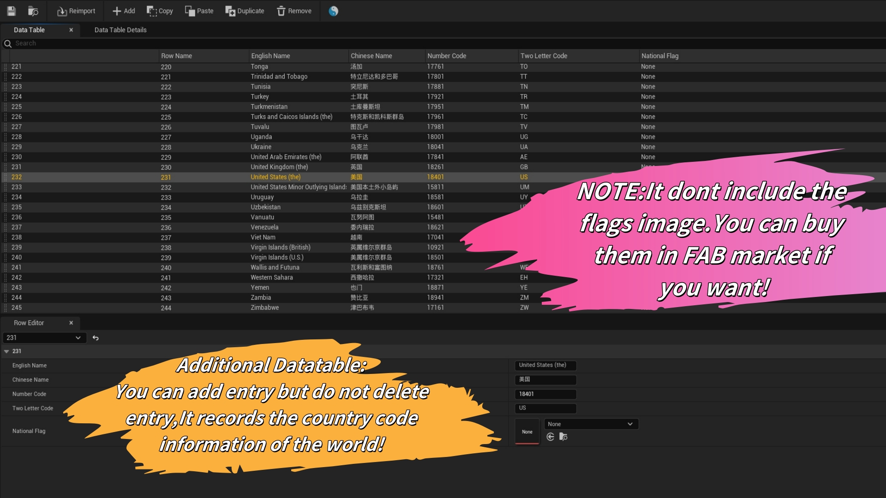
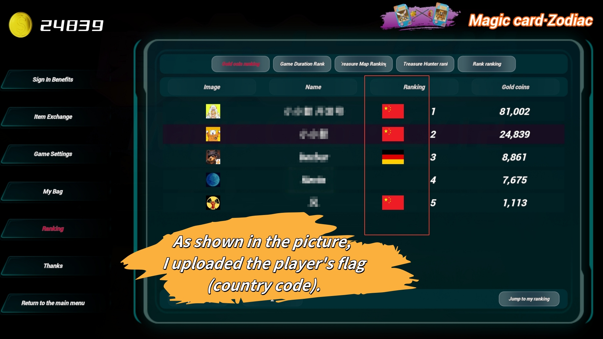

# EasySteamLeaderboards Plugin
# Easy Steam Leaderboards Documentation
# Jump to Chinese documentation: <a href="./README_cn.md">Chinese Version</a>

## 1. Installation
    *  After installing Easy Steam Leaderboards plugin, search for "Easy Steam Leaderboards" in the UE plugin manager, enable it, and restart Unreal Engine.

## 2. Configuration
    * Configure your leaderboard data in the Steamworks backend.
    * (You may refer to external tutorials for this step, as it is assumed you are already familiar with Steamworks setup.)

## 3. Use Upload Steam Leaderboards Nodes
    * In any Blueprint where you want to implement logic, right-click and search for Easy Steam Leaderboards, then select Upload Steam Leaderboards.

## 4. Input Parameters:

    * Steam Ranking Name: Enter the leaderboard name configured in your Steamworks backend.

    * Score: The player's in-game score or the value to add/subtract.

    * Detail Array (Max8 Int32): Create an array to store additional metadata (maximum of 8 Int32 entries). Examples: country code, timestamp, age, level, etc.

    * Upload Score Type: Choose between Forced Update Score (overwrite) or Keep Best Score (retain highest).

    * Upload Score Method: Select Change Score (directly modify), Add Score (increment), or Subtract Score (decrement).

## 5. Output Parameters:

    * Steam Upload Result: Use Break UploadLeaderboardResultData to extract post-upload player information.

## 6. Optional Nodes:

    * Get Player Country Letter Code and ESL Get Country INFO nodes allow fetching player nationality data (country name, numeric/letter codes, flag images).

    Note: Flag images require separate asset purchases (e.g., from FAB) and configuration in the plugin's DataTable.

## 7. Flag Configuration (Optional)
    * To use national flags:

    Navigate to the plugin’s content directory and edit DT_Countries_Code to configure flag icons.

    Flags are not included in the plugin due to licensing (third-party assets on FAB).

## 8. Downloading Leaderboards
    * In any Blueprint, right-click and search for Easy Steam Leaderboards, then select Download Steam Leaderboards.

## 9. Input Parameters:

    * Steam Ranking Name: The leaderboard name from Steamworks.

    * Request Data Type: Choose Global Rankings, Friends Rankings, or Nearly Rankings (nearby players).

    * Max Entries: Maximum entries to fetch.

    * Begin Rank Entry / End Rank Entry: Range of ranks to retrieve.

## 10. Use a "For Loop" to iterate through each leaderboard entry.

## 11. From Array Element, use Break DownloadLeaderboardRequestData to extract detailed player data.

## 12. Output Parameters:

    * Ranking: Player's global rank.

    * Steam Avatar: Player's profile image.

    * SteamID: Player's Steam ID.

    * Steam Name: Player's Steam username.

    * Score: Player's score.

    * Detail Array (Max8 Int32): Additional metadata stored with the score (up to 8 integers).

## 13. All Plugin Nodes:

## 14. Extra details (Detail Array) are stored as hexadecimal values in Steamworks (see example):

## 15. Leaderboard Customization:

    * Use metadata to enrich leaderboards (e.g., displaying player nationality flags):

