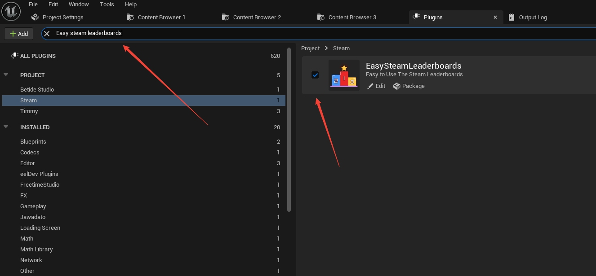
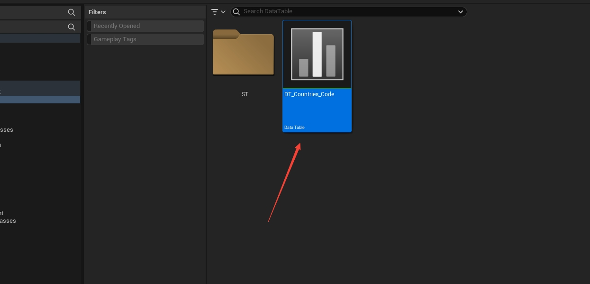
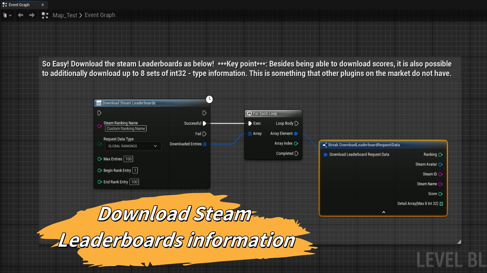
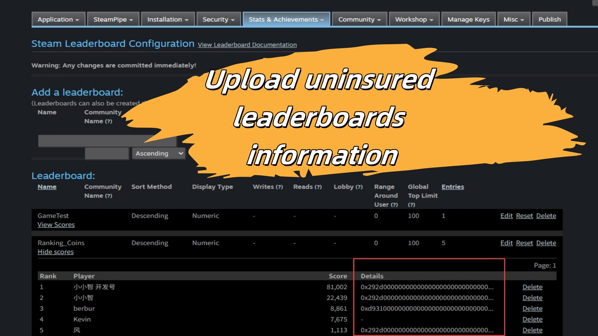

# EasySteamLeaderboards 插件

# Easy Steam Leaderboards 使用文档
# 点击跳转到英文使用文档：<a href="./README.md">英文</a>
# 重要事项：如果你想使用国旗功能，并使用我为你配置好的数据表。建议不要直接在插件内的数据表进行配置国旗图像。最好将插件内数据表复制到你的项目文件夹内进行配置图像。防止后面更新插件后，会覆盖掉插件内你配置过的数据表。

0. 预设值Config/DefaultEngine：请参照UE官方配置：<a href="https://dev.epicgames.com/documentation/zh-cn/unreal-engine/online-subsystem-steam-interface-in-unreal-engine?application_version=5.5">Steam相关重要配置</a>

1. 安装Easy Steam Leaderboards 后，在UE插件里搜索Easy Steam Leaderboards,勾选它。重启UE.

2. 在Steamwork后台配置好排行榜数据。（可自行搜索相关教程，默认你已经会配置相关设置。）
3. 在任何你想要实现逻辑的蓝图里，右键搜索Easy Steam Leaderboards,选择Upload Steam Leaderboards.
4. 输入参数说明：
    * Steam Ranking Name  ------ 填入你在Steamwork 后台配置的排行榜名称。
    * Score  ------ 填入玩家游戏中得到的分数，或增减的分数。
    * Detail Array(Max8 Int32)  ------ Make Array,传入你想要随分数一起记录的额外的信息。只能以32位整数形式记录。可以是国家代码，时间戳，年龄，等级，等等你所想要记录的信息。
    * Upload Score Type  ------ 选择Forced Updata Score（强制更新分数）或者 Keep Best Score(保持最佳得分)
    * Upload Score Method  ------ 选择Change Score（直接修改分数）或Add Score(增加传入分数)或Subtract Score(减掉传入分数)
5. 输出参数说明：
    * Steam Upload Resault  ------ 拉出引线，选择 Break UploadLeaderboardResaultData(中断UploadLeaderboardResaultData)，可得到上传后的玩家信息。
6. 额外的节点：
    * Get Player Country Letter Code节点 和ESL Get Country INFO节点，为有需要的用户提供的可选节点。可以获得玩家的国家名称，国家数字代码，国家字母代码，国旗图像（国旗图像有需求的话，可以在FAB上购买，并在插件中的DataTable中进行配置。）

7. 可选的功能：如果要使用国旗，可以到插件的目录内容文件中，找到DT_Countries_Code，配置每一项的国旗图标。（由于国旗属于FAB上其它作者的资产，本插件中不提供国旗资产。）

8. 在任何你想要实现逻辑的蓝图里，右键搜索Easy Steam Leaderboards,选择Download Steam Leaderboards.
9. 输入参数说明：
    * Steam Ranking Name  ------ 填入你在Steamwork 后台配置的排行榜名称。
    * Request Data Type  ------ 选择Global Rankings(全球排行榜)或Friends Rankings(好有排行榜)或Nearly Rankings(附加玩家排行榜)
    * Max Entries  ------ 最大的排行榜数量。
    * Begin Rank Entry  ------ 起始的下载排行榜条目。
    * End Rank Entry  ------ 结束的下载排行榜条目。
10. For Loop 后可以得到每个排行榜条目的玩家信息。
11. 从Array Element拉出引线，选择Break DownloadLeaderboardRequestData(中断DownloadLeaderboardRequestData),得到玩家详细信息。
12. 输出参数说明：
    * Ranking  ------ 排行榜条目的  玩家名次
    * Steam  ------ 排行榜条目的  玩家图像
    * SteamID  ------ 排行榜条目的  Steam ID
    * Steam Name  ------ 排行榜条目的  玩家Steam名字
    * Score  ------ 排行榜条目的  玩家得分
    * Detail Array（Max8 Int32）排行榜条目的  玩家额外的信息。（额外的信息最多可以存储8组整型数据）

13. 插件所有的节点如下：

14. 额外的条目信息（Detai Array）在Steamwork后台，以十六进制的形式存储的。如下图：

15. 排行榜分数外的额外信息，可以为排行榜信息添加更丰富的信息。下面排行榜参考图，为排行榜添加了玩家国籍对应的国旗。

